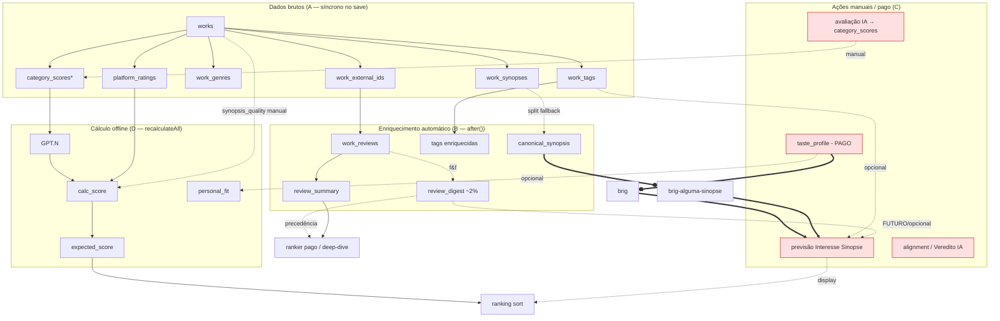

# Auditoria do ciclo de vida dos dados da obra

> Sessão read-only — 2026-06-18. Tudo confirmado **no código** (com `file:line`) e validado por
> **consulta read-only ao banco** (734 obras não-arquivadas). Nenhuma edição/migration/escrita foi feita.

---

## Resumo executivo

**Verificação empírica primeiro** — duas notas de memória estavam **desatualizadas** e foram corrigidas pela sondagem read-only ao banco:
- Migrations **108 (synopsis_quality_source), 107 (ai_cache_events), 105 (prediction_snapshots), 109 (golden)** estão **APLICADAS** (memória dizia "não aplicadas"). Logo o create/update **não está quebrado** — o código grava `synopsis_quality_source` em todo save e a coluna existe.

**O que existe COM CERTEZA ao fim do create manual** (síncrono):
- linha `works`, `category_scores` (só se o form trouxe notas — no create manual puro, normalmente **não há**), `platform_ratings`, `work_tags` (ids), `work_genres`, `work_covers`, `work_synopses`, `work_external_ids`
- `calculated_scores` (calc_score, expected_score, personal_fit) — **recalculateAll é awaited no create** (`server/actions/works.ts:1050`)

**O que existe COM CERTEZA ao fim do update** (síncrono):
- mesmos campos editados; **MAS `calculated_scores` fica STALE** — update usa `markRecalcPending`, não recalcula (`server/actions/works.ts:1439`). Assimetria importante: **create recalcula na hora; update adia (1h ou manual).**

**Automático assíncrono (`after()`, após a resposta):** canonical_synopsis, enriquecimento de tags, aquisição de reviews na borda (só com IDs aceitos), review_summary, review_digest (fire-and-forget), resolução de hid Comix, auto-previsão de Interesse Sinopse (só com perfil não-stub).

**Manual / on-demand:** avaliação IA completa, taste_profile, recomendações, deep_dive, alignment (Veredito IA), previsão de Interesse Sinopse em lote, "Recalcular agora", aplicar Interesse Sinopse.

**Derivado offline (recalculateAll, TS puro):** GPT.N, calc_score, expected_score, personal_fit, percentil.

**Dependências frágeis principais (detalhe no §11):**

| # | Fragilidade | Evidência empírica |
|---|---|---|
| 1 | **review_digest quase não existe** | **14 / 734 obras (2%)** |
| 2 | **Previsões de Interesse Sinopse 80% stale e sem auto-refresh ao mudar o perfil** | **826 stale / 200 fresh** |
| 3 | **taste_profile só regenera em fluxo PAGO**; previsões rodam contra perfil de 13 dias | v6, `is_stub=false`, 2026-06-05 |
| 4 | **calculated_scores fica stale após update** até recalc (1h/manual) | `markRecalcPending` |
| 5 | review_summary ausente em 1/3 do catálogo | 503 / 734 (68%) |
| 6 | provenance de synopsis_quality inútil hoje | **100% `legacy_unknown`** (0 human, 0 applied) |

---

## 1. Snapshot real do catálogo (read-only, 2026-06-18)

```
734  works (não-arquivadas)
734    canonical_synopsis ............ 100%   ← consolidação cobriu tudo
503    review_summary ................  68%
 14    review_digest ................   2%   ← praticamente AUSENTE
655    synopsis_quality (manual) .....  89%
192    user_score ....................  26%   ← conjunto de treino do Ridge
717    ai_eval_status=done ...........  98%   (6 pending, 0 review_pending, 11 skipped)
7363   work_reviews (linhas)
1026   synopsis_quality_predictions → 200 fresh / 826 STALE (80% stale)
   6   taste_profile (1 current: v6, não-stub, 2026-06-05)
synopsis_quality_source: 737 legacy_unknown / 0 human_manual / 0 prediction_applied
```

---

## 2. Matriz de disponibilidade

Categorias: **A**=garantido síncrono · **B**=automático assíncrono `after()` · **C**=manual/on-demand · **D**=derivado offline · **E**=importado/fluxo separado.

| Dado | Tabela.coluna | Cat | Produtor (file) | Existe no create? | Existe no update? | null? | Stale? | Readiness | Staleness | Falha isolada? | Consumidores | Fallback | Risco |
|---|---|---|---|---|---|---|---|---|---|---|---|---|
| works básicos | `works.*` | A | persistNewWork `works.ts:820` | sempre | sempre | não | não | linha existe | — | não | tudo | — | — |
| títulos alt | `works.alternative_titles` | A | idem | sempre | sempre | sim | não | — | — | não | dup-check, busca | `[]` | baixo |
| sinopses brutas | `work_synopses` | A | syncWorkSynopses `works.ts:486` | às vezes | às vezes | — | não | linhas | — | não | canonical, eval | — | baixo |
| **canonical_synopsis** | `works.canonical_synopsis` | **B** | scheduleSynopsisConsolidation `works.ts:42` | **não (async)** | só se sinopse mudou | sim | **sim** | `!= null` | `..._inputs_hash` | sim (engole) | Interesse Sinopse, recs, ranking | split+bloco mais longo `recommendations.ts:130` | médio |
| capa | `work_covers` | A | syncWorkCovers | às vezes | às vezes | sim | não | linha is_primary | — | não | UI, eval | — | baixo |
| IDs externos | `work_external_ids` | A/E | upsertWorkExternalIds | às vezes | às vezes | sim | não | linhas (is_rejected=false) | — | não | reviews, refresh | título-search | médio |
| platform_ratings | `platform_ratings` | A/E | persist/update | às vezes | às vezes | sim | sim | linhas | data_refreshed_at | sim | calc_score | prior global 8.0 | baixo |
| gêneros | `work_genres` | A | syncWorkGenres | às vezes | às vezes | — | não | só conhecidos | — | não | UI, eval | dropa desconhecidos | baixo |
| categorias/demografias | (tags por grupo) | A/B | tags ingest | às vezes | às vezes | — | sim | — | — | sim | perfil, fit | — | baixo |
| tags originais | `work_tags`+`tags` | A | syncWorkTags | sempre (se form) | sempre | — | não | linhas | — | não | tudo | — | baixo |
| **tags enriquecidas** | `tags.tag_group_id/subgroup` | **B** | scheduleTagEnrichment `ingest.ts:114` | **não (async)** | idem | sim | sim | group != null | — | sim (engole) | perfil/fit (via group) | group=null | médio |
| **reviews brutas** | `work_reviews` | **B/E** | acquire `acquire-reviews.ts:27` / eval | **só Path B ou IDs aceitos** | só "Atualizar dados" c/ opt-in | sim | sim | linhas | fetched_at | sim (engole) | summary, digest, eval | pool persistido | **alto** |
| **review_summary** | `works.review_summary` | **B** | persistReviewSummary `persist-reviews.ts:157` | não | não | sim | sim | `!= null` | `..._inputs_hash` (`hash:n`) | sim (engole) | recs, deep-dive | nenhum | médio |
| **review_digest** | `works.review_digest` (jsonb) | **B/C** | persistReviewDigest (f&f) `persist-reviews.ts:221` + batch | não | não | sim | sim | `!= null` & `version atual` | `review_digest_version`/`_n` | sim (engole) | ranker, deep-dive (precedência) | review_summary | **alto (2%)** |
| **taste_profile** | `taste_profile` | **C** | insertNewTasteProfile `taste-profile.ts:144` | não | não | — (stub) | **sim** | `is_current & !is_stub` | `input_hash` vs lib | sim | Interesse Sinopse, fit, recs | stub / heurístico | **alto** |
| **synopsis_quality (manual)** | `works.synopsis_quality` | **C** | form / apply / set `synopsis-quality.ts:127` | só se digitado | só se digitado | sim | não | enum setado | — | não | calc_score, Ridge | null→imputer | médio |
| **synopsis_quality_predictions** | tabela própria | **C/B** | runner `synopsis-quality-runner.ts:22` | não | não | sim | **sim** | row `stale=false` | `taste_profile_hash` (assinatura) | sim (engole) | ranking (display), detalhe | null = "não prevista" | **alto (80% stale)** |
| category_scores | `category_scores` | C(IA)/A(manual) | triggerAiEvaluation / form | só Path B/manual | só se editado | sim | não | 9 slugs | — | sim | GPT.N, expected | omite slug | médio |
| ai_evaluation_scores | `ai_evaluation_scores` | C | triggerAiEvaluation `ai.ts:106` | só Path B | não | sim | não | eval completed | input_hash | sim (failed) | review UI | — | médio |
| GPT.N | `calculated_scores.ia_eval_normalized` | D | recalculateAll `calculations.ts:601` | sim (create) | **stale** | sim | sim | linha calc | calculated_at | sim | calc/expected | — | médio |
| calc_score | `calculated_scores.calc_score` | D | recalculateAll | sim | **stale** | sim | sim | linha | calculated_at | sim | expected blend, ranking | — | médio |
| **expected_score** | `calculated_scores.expected_score` | D | recalculateAll | sim | **stale** | sim | **sim** | linha | recalc_pending | sim | ranking (sort default) | média treino | médio |
| personal_fit (+pct) | `calculated_scores.personal_fit*` | D | recalculateAll | sim (se perfil) | **stale** | sim | sim | perfil efetivo existe | — | sim | ranking, tiers | null | baixo |
| tiers / mood-adjusted | em memória (ranking) | D/C | computeTiers / mood-refine | sob demanda | sob demanda | — | — | — | — | — | ranking | — | baixo |
| **alignment_score (Veredito IA)** | `works` (persistido) | **C** | re-rank manual | não | marcado stale `works.ts:1419` | sim | **sim** | não-stale | edição marca stale | sim | ranking opcional | sem veredito | médio |
| deep_dive | `deep_dive_results` | C | deep-dive action | não | não | sim | sim | row | — | sim | UI | — | baixo |
| recomendações | `recommendation_runs` | C | runRecommendation | não | não | — | — | — | — | sim | UI | — | baixo |

---

## 3. Fluxos reais reconstruídos

### 3.1 Criar obra manualmente (`createWork`)
```
form → workFormSchema.safeParse → dup-check (title/aliases)
SÍNCRONO (awaited, dentro da resposta):
  insert works (ai_eval_status="pending", synopsis_quality_source set)
  [se aiJustifications] insert ai_evaluations(completed) + ai_evaluation_scores
  insert category_scores (manual OU ai_accepted) | platform_ratings
  syncWorkTags  → scheduleTagEnrichment(after)        ▲ enfileira B
  syncWorkGenres | syncWorkCovers | syncWorkSynopses
  scheduleSynopsisConsolidation(after)                ▲ enfileira B
  upsertWorkExternalIds
  update ai_eval_status (done se 9 notas | review_pending | pending)
  [Path B] await saveWorkReviews(pool)  → summary(await) + digest(f&f)
  [Path A] after: acquireAndPersistWorkReviews (só se IDs aceitos)  ▲ B
  after: resolveComixHidForWork                         ▲ B
  await recalculateAll()   ← BLOQUEIA: calc/expected/personal_fit prontos
  revalidate paths → retorna {id, slug}
DEPOIS DA RESPOSTA (after, ordem não-garantida entre si):
  consolidação sinopse → canonical_synopsis → markStale + autoPredict(se perfil)
  enrich tags | edge reviews → work_reviews → summary → digest | comix hid
```
**Ausentes ao voltar pra UI:** canonical_synopsis, tags enriquecidas, reviews/summary/digest, previsão de Interesse Sinopse. **Presentes:** notas calc/expected/personal_fit (recalc é awaited).

### 3.2 Atualizar obra (`updateWork` / `updateWorkStatus` / `updateWorkExternalData`)

| Mudança | Dispara reprocessamento? |
|---|---|
| sinopse (work_synopses) | `scheduleSynopsisConsolidation` (B) → se hash muda: canonical → previsão Interesse marcada stale + autoPredict |
| título | revalida slugs; sem reprocesso de dados |
| tags | enriquecimento de tags novas (B); **recalc só pendente** |
| notas/critérios/synopsis_quality | `markRecalcPending` (calc/expected stale) + `markWorkAlignmentStale` |
| reviews | só via `updateWorkExternalData({acquireReviews:true})` → acquire (B) |
| 1ª user_score | `capturePredictionForFirstRating` + `resolvePredictionsForWork` |

Diferença-chave: **update NUNCA recalcula na hora** (≠ create). Recalc real só em "Recalcular agora" ou auto ≥1h sem edições (`server/actions/recalc-queue.ts:73`, disparado no page-load via badges).

### 3.3 "Buscar dados" (Path B, create externo)
`searchAllSources` → `fetchMultiSourceDetails` → user escolhe → `evaluateCandidateForCreate` (`external.ts:277`) **roda o LLM já no wizard** (reviews fetchadas aqui, gate `needsReviewConfirmation` se sem reviews) → user revisa notas → `createWork(values, aiMeta, externalReviews)`. **Difere do create manual:** já nasce com notas IA + reviews + summary síncronos; digest f&f; recalc síncrono. **A avaliação IA aqui é parte do wizard, disparada pelo usuário — não é background.**

### 3.4 Reviews → summary → digest (`lib/external/persist-reviews.ts`)
```
saveWorkReviews (merge NÃO-destrutivo por fonte; vazio = no-op preserva)
  → relê TODAS as reviews da obra
  → persistReviewSummary  (AWAIT, Haiku; gate: cold OU mudança material)
  → persistReviewDigest   (FIRE-AND-FORGET, Sonnet; gate: cold OU versão OU material)
```
- summary e digest **leem o conjunto completo** (não só o batch).
- digest **não bloqueia**, **não tem retry/fila**, **engole erro** → explica os **2% de cobertura**.
- summary depende de ≥1 review com texto; digest idem. Ambos podem faltar/falhar isoladamente. **Digest NÃO depende do summary** (paralelos, independentes).

### 3.5 Avaliação IA completa — **manual/on-demand confirmado**
Disparada **só** por: página `/ai-evaluation` (`ai-evaluation-panel.tsx`), botão na página da obra (`ai-evaluation-button.tsx`), e chat de recomendação (pago, iniciado pelo user). **Nenhum caminho automático/background.** `ai_eval_on_create` apenas mostra a seção de critérios no form (`showCriteriaSection`), não dispara eval. Entradas: title, sinopse primária, tags, genres, reviews (externas+manuais), contexto externo, ratings, similares, content ratings, capa. Saídas: `ai_evaluations` + `ai_evaluation_scores`; `ai_eval_status="review_pending"`. **Nunca rodou ⇒** sem `category_scores` IA → GPT.N/expected caem em features parciais; obra não bloqueia nada automático.

### 3.6 Potencial de Interesse (`synopsis_quality_predict`)
Entrada real (`lib/ai-evaluation/synopsis-quality-predictor.ts:102`): **perfil de gosto (obrigatório, não-stub) + título + tags + sinopse** (canonical preferida, fallback raw mais longo). **Só isso.** Gatilhos: auto (após consolidação, se perfil não-stub), por-obra (pago, on-demand), lote (pago), rascunho (form). **Ordem:** roda *depois* da consolidação; **independe** de review_digest e de notas. Staleness = `taste_profile_hash` (assinatura de conteúdo do perfil) ou sinopse canônica muda. Sem perfil → erro/stub; sem sinopse → erro; sem tags → roda (tags são contexto); sem reviews → irrelevante (não usa).

### 3.7 Recalcular notas (`server/actions/calculations.ts:438`)
Tudo TS puro, 1 passada na base. Trata ausências: sem user_score → fora do treino; treino <20 → stub (média); sem perfil efetivo → features de fit ficam null (imputer); sem platform_ratings → prior global; sem synopsis_quality → imputer. **Usa o estado atual do DB** — pode ler dados stale (ex.: canonical ainda não consolidada não afeta, pois score não depende dela). Pode rodar sem avaliação IA (category_scores parcial/vazio).

### 3.8 taste_profile (`lib/ai-recommendation/ensure-profile.ts`)
Gatilho: **só fluxos pagos** (recommendations/chat/synopsis per-work) via `loadOrEnsureProfile`. Regenera (LLM) **apenas** com `refreshIfStale:true` E `input_hash` mudou E ≥10 obras — hoje **só o chat passa `refreshIfStale`**. Single-flight por input_hash. Novo perfil → `markAllProfilesAsStale` + `markSynopsisPredictionsStale(assinatura)`. **Uma mudança pequena na biblioteca NÃO invalida o catálogo** (assinatura de conteúdo, não input_hash). **Mas:** marca stale e **não re-prevê** → fica stale até lote/sinopse mudar.

---

## 4. Mapa de jobs

| Job | Disparado por | Aguarda? | Paralelo? | Depende de | Produz | Falha sem bloquear? |
|---|---|---|---|---|---|---|
| recalculateAll | create (await) / recalc-now / auto-1h | **create: SIM**; update: não | coalescido (guard) | works+scores+perfil | calculated_scores, formula_config | parcial: throw no create |
| consolidação sinopse | create/update (after) | não | sim | work_synopses | canonical_synopsis | sim (engole) |
| autoPredict Interesse | dentro da consolidação | não | — | perfil não-stub + canonical | synopsis_quality_predictions | sim (engole) |
| enrich tags | save (after) | não | sim | tags novas | group/subgroup/cluster | sim (engole) |
| edge reviews | create Path A / update opt-in (after) | não | sim | IDs aceitos | work_reviews | sim (engole) |
| review_summary | dentro de saveWorkReviews | **sim** | não | work_reviews | works.review_summary | sim (engole) |
| review_digest | dentro de saveWorkReviews | **não (f&f)** | sim | work_reviews | works.review_digest | sim (engole) |
| comix hid | create (after) | não | sim | — | work_external_ids(comix) | sim (engole) |
| taste_profile | recomendação/chat (pago) | sim | single-flight | ≥5/≥10 obras rotuladas | taste_profile | erro propaga ao caller |
| avaliação IA | botão/página (manual) | sim | — | contexto externo | ai_evaluation* | marca failed |

**Não afirmar ordem entre os `after()`** — disparam concorrentes sem fila. O único acoplamento ordenado garantido: consolidação → autoPredict (sequencial, mesmo callback).

---

## 5. Dependências manuais em fluxos automáticos

| Fluxo automático | Depende de | Classificação |
|---|---|---|
| recalculateAll (D) | category_scores IA | **opcional com fallback** (features parciais; imputer) ✅ |
| recalculateAll → personal_fit | taste_profile (manual/pago) | **opcional com fallback** (null se sem perfil) ✅ |
| autoPredict Interesse (B) | taste_profile não-stub | **frágil**: silenciosamente no-op se stub/ausente; nada re-tenta depois ⚠️ |
| autoPredict Interesse (B) | canonical_synopsis (B) | seguro (roda dentro da consolidação) ✅ |
| ranker/deep-dive (pago) | review_digest (2%) | **opcional com fallback** (cai p/ summary) ✅ mas o sinal rico quase nunca existe |
| previsões frescas | re-previsão após perfil mudar | **quebrada**: marca stale e ninguém re-prevê (só lote manual/sinopse) ⚠️ |

**Nenhum fluxo automático trata avaliação IA como obrigatória** — bom. O risco está em (a) autoPredict que depende de perfil pago e some sem aviso, e (b) staleness sem auto-refresh.

---

## 6. Contrato proposto — Potencial de Interesse

| Entrada | Obrig/Opc | Quando existe | Fallback | Bloqueia? | Recalcula quando chega? |
|---|---|---|---|---|---|
| taste_profile (não-stub) | **Obrigatória** | só fluxo pago, ≥10 obras | nenhum (estado `not_ready`) | **sim** | hoje: marca stale, **não re-prevê** (gap) |
| canonical_synopsis | Opcional-forte | B, ~100% catálogo | sinopse bruta (split+maior bloco) | não | sim (autoPredict na consolidação) |
| 1 sinopse bruta | **Obrigatória** (alguma) | A, no save | — | **sim** (sem sinopse = erro) | — |
| tags originais | Opcional | A | `[]` (só contexto) | não | não |
| tags enriquecidas (grupo) | Opcional | B | group=null (perde agrupamento no prompt) | não | não |
| gêneros/categorias/demografias | Opcional | A | omitido | não | não |
| review_digest | Opcional (**futuro**, §8) | B (2%) | omitir | não | deveria, se adotado |
| review_summary | Opcional (futuro) | B (68%) | omitir | não | idem |

**Não incluir como requisito** (corretamente já é assim): category_scores, ai_evaluation_scores, GPT.N, calc_score, expected_score, alignment_score, deep_dive.

---

## 7. review_digest como entrada (§8 respondido)

| Pergunta | Resposta |
|---|---|
| Tabela/coluna | `works.review_digest` (jsonb) + `_at/_n/_version` (mig 103, **aplicada**) |
| Produtor | `persistReviewDigest` (f&f) + batch `consolidatePendingReviewDigests` (settings, manual, 10/run) |
| Automático? | parcial (f&f no save de reviews) |
| Todas recebem? | **Não — 14/734 (2%)** |
| Depende de reviews mínimas? | sim (≥1 review com texto) |
| Pode faltar/stale/falhar? | sim / sim (version+n) / sim (engole) |
| Interesse pode rodar antes? | **sim** — são independentes |
| Mudança no digest invalida previsão? | **não hoje** (previsão não usa digest) |
| Fallback seguro | review_summary (68%) → nada |

**Schema do digest** (campos separados por natureza):
- **Perfil da obra (descritivo):** `salient_traits[{trait,polarity,axis: moralidade/tom/ritmo/arte/romance/personagens}]`, `consensus`, `divergence`
- **Qualidade de execução:** `execution`
- **Notas/popularidade:** (não está no digest; vive em platform_ratings)
- **Spoilers/avisos:** `content_warnings`
- **Metadados técnicos:** `review_digest_version`, `review_digest_n`, `review_digest_at`

Veredito: o digest é **a entrada certa** para os atributos que você quer (personalidade da FL, agência, dinâmica romântica, tom, humor, drama) — mas hoje é **inexistente na prática**. Usá-lo exige um **backfill** antes (§13).

---

## 8. Estados de prontidão (Interesse Sinopse)

```
not_ready      ← taste_profile ausente OU is_stub; OU nenhuma sinopse utilizável
ready_partial  ← perfil não-stub + sinopse bruta, MAS sem canonical (usa fallback)
               OU tags ainda não enriquecidas
processing     ← consolidação/previsão em voo (after em andamento)
ready_complete ← perfil não-stub + canonical_synopsis + tags enriquecidas
stale          ← taste_profile_hash ≠ assinatura atual  OU  canonical mudou pós-previsão
failed         ← previsão lançou (sem tool / schema) ou perfil indisponível
```
Hoje o código só materializa `stale` (flag) e `not_ready` (erros). Os demais são implícitos.

---

## 9. Diagrama de dependências


(Linhas tracejadas = opcional/fallback; `==` = obrigatória. Avaliação IA aparece como manual — **não** automática.)

---

## 10. Recomendação arquitetural — **Opção C (híbrida)**

O código **já é quase-A** (roda com mínimo + flag stale + fallback split). O problema não é a estratégia, é a **prontidão implícita** e a **falta de auto-refresh**. Recomendo **C** porque:

| | A (parcial+recompute) | B (espera tudo) | **C (híbrida)** |
|---|---|---|---|
| latência | baixa | alta (obras sem reviews travam) | baixa |
| obras sem reviews/digest | ok | **bloqueiam p/ sempre** | ok (parcial explícito) |
| consistência | reprocesso múltiplo | alta | controlada por assinatura |
| custo | risco de re-prever à toa | baixo | médio (gate por assinatura) |
| UI | não distingue | — | **distingue parcial/completo** |

**C concretamente:** (1) sinopse = único requisito duro; (2) digest/summary estritamente opcionais com fallback; (3) expor `readiness` (§8) na UI/ranking; (4) o ranker **escolhe** se aceita parcial; (5) **fechar o gap de re-previsão** após mudança de perfil (hoje quebrado).

---

## 11. Casos explícitos

| # | Caso | Comportamento atual | Recomendado |
|---|---|---|---|
| 1 | criada s/ reviews | sem work_reviews; summary/digest ausentes; previsão roda só com sinopse | ok (parcial) |
| 2 | importada c/ reviews | Path B: reviews+summary síncronos; digest f&f | ok |
| 3 | reviews não resumidas | summary ausente até gate disparar | backfill manual |
| 4 | summary sem digest | **estado real de ~489 obras** | digest opcional |
| 5 | digest stale | version/n re-gera no save; senão fica | batch |
| 6 | digest falhou | engolido, sem retry | adicionar retry/fila |
| 7 | sem canonical | fallback split+maior bloco | ok |
| 8 | 1 sinopse bruta | consolida (mesmo 1 bloco) | ok |
| 9 | sem tags enriquecidas | group=null no prompt | ok (degrada) |
| 10 | sem taste_profile | previsão = erro/no-op | `not_ready` explícito |
| 11 | sem avaliação IA | nada bloqueia; features parciais | ok |
| 12 | avaliação IA antiga | não re-avalia sozinha | aceitável (manual) |
| 13 | sinopse muda pós-previsão | consolida → marca stale → autoPredict (se perfil) | ok |
| 14 | reviews mudam pós-previsão | previsão NÃO usa reviews → não afeta | ok (até adotar digest) |
| 15 | tags mudam pós-previsão | **previsão não marcada stale** | marcar stale se for usar tags forte |
| 16 | mudança no taste profile | marca 100% stale, **não re-prevê** → 826 stale | **auto-refresh ou job de backfill** |

---

## 12. Riscos priorizados

**🔴 Bloqueante:** nenhum (create/update funcionam; verificado).

**🟠 Alto**
1. **review_digest 2%** — se o Interesse passar a depender dele, 98% das obras caem no fallback. Precisa backfill antes de virar entrada.
2. **Previsões 80% stale sem auto-refresh** — mudou o perfil, ninguém re-prevê. Ranking mostra ♥ desatualizado.
3. **taste_profile só regenera em fluxo pago** — previsões rodam contra perfil de 13 dias; biblioteca já tem 192 rotuladas vs hash de v6.

**🟡 Médio**
4. expected_score stale após update (1h/manual) — ranking pode exibir nota velha.
5. review_summary ausente em 32%.
6. autoPredict depende de perfil não-stub e falha silenciosa.
7. Memória de migrations desatualizada (corrigida aqui) — confie na sondagem, não nas notas.

**🟢 Baixo**
8. provenance `synopsis_quality_source` 100% legacy (sinal inútil até re-saves).
9. Ordem entre `after()` não-determinística (benigno hoje).

---

## 13. Próximos passos

**1. Correções necessárias**
- Fechar o gap de **re-previsão após mudança de perfil** (job de backfill das stale, ou auto-refresh no recalc/page-load com teto de custo).
- Decidir refresh do **taste_profile fora do fluxo pago** (ou avisar que está velho).

**2. Melhorias recomendadas**
- Materializar `readiness` (§8) em `synopsis_quality_predictions`/ranking.
- **Backfill de review_digest** (`consolidatePendingReviewDigests` em lote) antes de usá-lo como entrada.
- Retry/fila para digest f&f.

**3. Decisões que dependem do usuário**
- review_digest é entrada **futura**: confirmar adoção e custo do backfill (734 × Sonnet).
- Estratégia A/B/C (recomendado **C**).
- Tornar tags-change → previsão stale? (só se o peso das tags no prompt crescer.)

**4. Não implementar ainda**
- Nada de código nesta sessão (read-only). Sem refactor de jobs, sem mexer em provenance histórico, sem ligar L0_QUALITY.

---

### Apêndice — correções de fato vs. memória (validado read-only 2026-06-18)
- Migrations **107, 108, 109** (e **105**) estão **APLICADAS** no banco (memória dizia pendentes).
- `synopsis_quality_source` existe e é gravado em todo create/update; hoje 100% `legacy_unknown`.
- Cobertura real: canonical 100% · review_summary 68% · **review_digest 2%** · user_score 26% · previsões 80% stale.
- taste_profile corrente: v6, não-stub, 2026-06-05 (não regenera sozinho).
