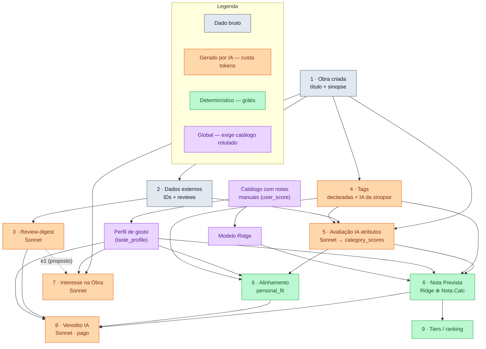

# Mapa de dados, notas e roadmap

> Visão única de **como os dados derivam uns dos outros**, o que cada **nota** significa,
> o que **já está implementado** e as **propostas em andamento**.
> Atualizado em 2026-06-27.

> **Status 2026-06-27 (sessão de ops de avaliação IA):**
> - **e1 (digest no Interesse) JÁ ESTÁ NO MAIN** (PR #15, `PROMPT_VERSION="v3"`). Pendente é só **rodar em produção com backfill** → ver `PLANO-E1-PRODUCAO.md`.
> - **Alinhamento** (`personal_fit`) e o desempate (`tag_overlap_net`) passaram a usar **overlap líquido por NOME** (`netNameOverlap`), não mais os 3 componentes.
> - **Avaliação IA de atributos** usa **reviews cruas** (manual + raspadas), **não** o digest. Desde **v20** a citação é **genérica** (sem exigir IDs R1/R2; `enforceAuditableReviewUsage` virou não-fatal).
> - Novas ferramentas na fila "✨ Avaliar": **buscar reviews+digest** e **inferir tags** (individual/fila); flag **"Reviews novas"** quando o pool muda após a avaliação (migration 120).

---

## 1. Diagrama de dependências

🟠 custa tokens · 🟢 grátis · 🟣 global (depende do catálogo já ter notas manuais) · ⬜ dado bruto.

---

## 2. Glossário das notas

| Label na UI | Coluna | Como é calculada | LLM? | Escala | Para quê serve |
|---|---|---|---|---|---|
| **Nota.Calc** | `calc_score` | blend determinístico IA.N + média de plataforma (Bayesiano) | não | 0–10 | âncora interna (entra no blend da Nota Prevista) |
| **Nota Prevista** | `expected_score` | **Ridge ⊕ Nota.Calc** (treinado nas suas notas) | não (ML local) | 0–10 | **prever a nota que VOCÊ daria** |
| **Alinhamento** | `personal_fit` | determinística: **overlap líquido por NOME** (amado − 1,5×evitado, `netNameOverlap`), normalizado [0,1] | não | 0–1 (exibe percentil) | **overlap com o seu gosto declarado/aprendido**; filtro + insumo do Veredito. *(desde 2026-06-27; antes eram 3 componentes — bootstrap mostrou net_name melhor)* |
| **Veredito IA** | `alignment_score` | **LLM Sonnet** (re-rank holístico) | **sim** | 0–100 | **diferenciar/ordenar e explicar** com leitura de reviews/sinopse |
| **Interesse na Obra** | `synopsis_quality` / predictions | **LLM Sonnet** | **sim** | ♥–♥♥♥♥ | quão a sinopse te atrairia (antes de ler) |

> ⚠️ Os filtros em `formula_config` têm nomes **repurposados** que NÃO batem com o label:
> `min_final_score` = Nota Prevista · `min_calc_score` = Alinhamento · `min_predicted_score` = Veredito IA. Não renomear.

### Nota Prevista vs Veredito IA — interpretação
- **Nota Prevista** responde *"que nota você daria?"* — número absoluto, calibrado na sua escala, MAE medido (~0,58–0,60), grátis e para **todo** o catálogo. É o eixo principal do ranking. Limite: o catálogo é pré-filtrado → baixa dispersão (std ≈ 0,67) → **satura no topo** (por isso existem tiers + desempate por tags).
- **Veredito IA** responde *"quão alinhada, na leitura de um LLM que viu reviews/sinopse/risco?"* — score **relativo** 0–100 + justificativa. Não é calibrado em escala absoluta, é caro, fica obsoleto e é só sob demanda/pago. Ganho: lê nuance que o modelo numérico não enxerga → **diferencia melhor as obras no topo** e explica o porquê.
- **Qual é "mais preciso"?** Depende da pergunta: para **estimar a nota absoluta**, Nota Prevista (é literalmente treinada nisso). Para **separar obras parecidas e explicar**, Veredito IA (empiricamente forte só no topo). **Alinhamento** é o mais fraco como diferenciador (quase constante no catálogo atual, std ≈ 0,06) — serve como filtro transparente e insumo do Veredito, não como ranker.

### Alinhamento (personal_fit) — detalhe
Determinístico, 0–1, computado no recalc. Combina:
1. **40% tags** — soma da `strength` das tags amadas presentes na obra vs. máximo possível, menos 1,5× as evitadas presentes.
2. **30% faixas de critério** — quanto os 9 `category_scores` caem dentro das faixas ideais do perfil (cai linearmente fora da faixa).
3. **30% consistência** — fração das tags da obra que são amadas menos as evitadas.

Retorna `null` se o perfil é stub. **Não é previsão de qualidade** (isso é a Nota Prevista) — é "quanto bate com a sua impressão digital de gosto".

---

## 3. Ordem de geração para uma obra nova

1. **Criar a obra** (título + sinopse).
2. **Dados externos** → IDs aceitos.
3. **Adquirir reviews** (depende dos IDs) → **review-digest + resumo** geram em série.
4. **Tags**: declaradas (das fontes) + **inferidas da sinopse por IA** (novo — roda no create).
5. **Avaliar atributos com IA** (sinopse + reviews + tags) → aceitar → `category_scores`.
6. **Recalcular**: GPT.N → Nota.Calc → **Nota Prevista** + **Alinhamento**.
7. **Interesse na Obra** (sinopse + tags + perfil) — paralelo, não depende de 5/6.
8. **Veredito IA** (pago; category_scores + tags + perfil + digest).
9. **Tiers** emergem da Nota Prevista no /ranking.

> Pré-requisito global: perfil + Ridge treinados (catálogo já com notas manuais). Obra nova sem nota só **consome** esses; não os gera.

---

## 4. Implementado nesta frente (2026-06-27)

- **Inferência de tags no create** — `lib/tags/auto-infer.ts` + `after()` em `createWork`. Infere tags da sinopse via Haiku (só confiança "alta" 0.9), grava `source='ai_inferred'`, marca recalc pendente. Usa só a sinopse ⇒ sem corrida com a aquisição de reviews.
- **Toggle "sinopse canônica na criação"** — `migration 119` (default `true`, **a aplicar à mão**), query/action/componente, gate em `persistNewWork`. Não afeta edição/atualização.
- **Ordem reviews → resumo → digest blindada** — opção `awaitDerived` em `saveWorkReviews`; o caminho de background (`acquireAndPersistWorkReviews`) aguarda a cadeia em série, garantindo digest sobre o conjunto completo.
- **Veredito IA com digest (já existia)** — confirmado: todos os caminhos de candidato buscam `review_digest` e o prompt prioriza **digest → resumo → nada** (`prompts.ts` `formatReviewDigestBlock`).

### Como o digest é implementado
- **O que é**: distilação estruturada das reviews, **agnóstica às suas preferências** (polaridade = visão do consenso, não a sua → seguro contra leakage). Campos: `consensus`, `divergence`, `salient_traits[]` (traço + eixo + polaridade), `content_warnings[]`, `execution`.
- **Como/onde**: `buildReviewDigest` (Sonnet `claude-sonnet-4-6`, tool `submit_review_digest`); gerado quando reviews são salvas (`ensureReviewDigest`), guardado em `works.review_digest` (JSONB), com gate de versão/materialidade para não re-rodar à toa. O **resumo** (texto, Haiku) é o fallback mais barato.

---

## 5. Propostas em andamento

### A) e1 — digest na previsão de Interesse  *(CÓDIGO no main; falta rodar em produção)*
Validação `golden-3` (n=180): e1 (com digest) bate b1 (sem) — MAE **0,46 vs 0,67** no dev (ΔMAE −0,21, IC [−0,31;−0,12]); holdout 0,42 vs 0,58 (Δ borderline). **O código e1 já foi mergeado no main (PR #15, `PROMPT_VERSION="v3"`)** — o predictor usa `works.review_digest` (fallback resumo) e o digest entra na assinatura de staleness.

**Pendente = operação em produção** (sem código novo) → detalhado em **`PLANO-E1-PRODUCAO.md`**:
1. Aplicar migrations pendentes (119 toggle canônica, 120 stale por reviews).
2. **Maximizar tags → reviews → digest** ANTES do backfill (ordem importa: tag muda a assinatura do Interesse; digest é o input do e1).
3. **Backfill do Interesse** (`planInterestBackfill` dry-run → `runInterestBackfill`, ~$8) — o bump pra v3 deixou as predições "absent", então precisa rodar.
4. Verificar no painel `/curation/model-metrics`.

**Reaproveitar testes:** os 180 rótulos humanos servem de ground-truth; as predições e1 do teste **não** foram pro banco ⇒ o backfill ainda precisa rodar sobre o catálogo.

### B) Melhorar a Nota Prevista *(hipóteses — validar OOF sem leakage + lift)*
Já mortos: embeddings/kNN, per-source, digest no Ridge, Interesse como feature, legados (leak). Alavanca dominante: mais rótulos.
| Ideia | Aposta |
|---|---|
| Objetivo de **ranking (pairwise/NDCG)** em vez de MAE — o uso é ordenar, não acertar valor absoluto | **alta** |
| Features de **distribuição das reviews** (variância de rating, % positivas, nº por fonte) | média |
| **Recalibração isotônica** do output do blend (rápido, baixo risco) | baixa-média |
| **Predição conformal/quantílica** → tiers mais honestos + flag de baixa confiança | produto |
| **Active learning** — rotular primeiro o que o modelo tem mais incerteza | eficiência |

---

## 6. Custos (token) por ação

| Ação | Modelo | Custo | Pago? |
|---|---|---|---|
| Avaliação IA atributos | Sonnet | alto (domina) | toggle |
| Veredito IA | Sonnet | médio | **sim** |
| Interesse na Obra | Sonnet | médio | sim |
| Review-digest | Sonnet | médio | não |
| Perfil de gosto | Sonnet (pago) / heurística (free) | médio | LLM só pago |
| Sinopse canônica · Resumo reviews · **Tags IA (create)** | Haiku | baixo | não |
| GPT.N · Nota.Calc · **Nota Prevista** · **Alinhamento** · tiers | — (local) | **$0** | — |

---

Relacionado no repo: `HANDOFF-OTIMIZACAO-E-DIGEST.md`, `PLANO-ATUAL.md`.
